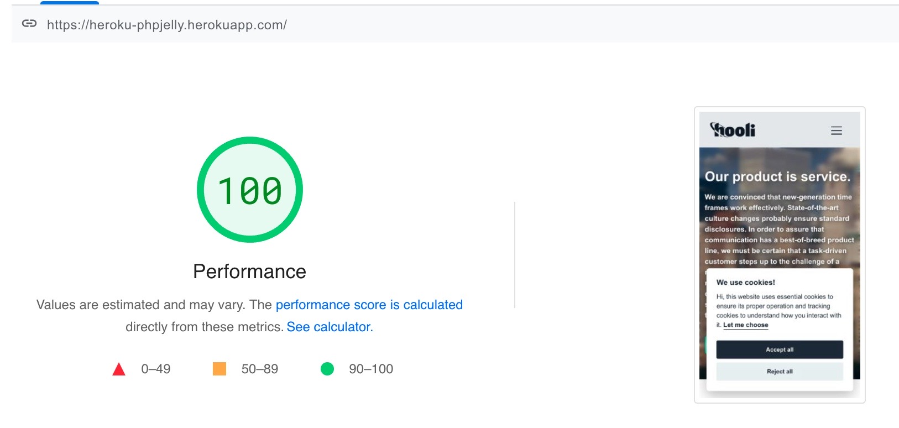

# PHP Jelly

<description>Stupid fast semi-static PHP/HTML/JS website starter. Built-in tailwind dark mode, dark mode toggle and GDPR/CCPA compliant cookie consent. Leveraging the gargantuan Nodejs ecosystem for local development, tailwind for styling and PHP/HTML/JS for semi-static creation. Deploy insanely fast with Heroku PHP Buildpack, PHP Composer, and a Procfile. Push changes near instantly by utiliziing Heroku's pipline feature and configuring automatic branch deployments. Compaitible with Heroku's free and paid dynos.</description>

- [Live Preview](https://phpjelly.com/ "Live View")
- [Live Page Speed Test](https://pagespeed.web.dev/report?url=https%3A%2F%2Fphpjelly.com%2F "Page Speed Report")

#### Deploy With

- PHP Composer
- Heroku PHP Buildpack
- Heroku Cloudflare Purge Buildpack (Optional)
- Heroku Free and Paid Dynos

## Install on Linux

- Create new repo with [PHP Jelly](https://github.com/fuelviews/phpjelly/generate) repo
- Clone "PHP Jelly" repo locally `git clone your-repo-url`
- Install Docker and Docker Compose
- Install [Homebrew]("https://brew.sh/")
- Navigate to the root of your newly cloned repo in terminal
- Install homebrew packages `brew install node yarn`
- Install node packages `yarn install`

## Install on MacOS

- Create new repo with [PHP Jelly](https://github.com/fuelviews/phpjelly/generate) repo
- Clone "PHP Jelly" repo locally `git clone your-repo-url`
- Install Docker Desktop and enable Docker Compose
- Install [Homebrew]("https://brew.sh/")
- Navigate to the root of your newly cloned repo in terminal
- Install homebrew packages `brew install node yarn`
- Install node packages `yarn install`

## Install on Windows

### Step One

- Install Docker Desktop and enable [Docker Compose + WSL Backend](https://docs.docker.com/desktop/windows/wsl/#:~:text=Start%20Docker%20Desktop%20from%20the,will%20be%20enabled%20by%20default.)
- Install VS Code, install All "Remote Development" extentions, install All "WSL" and "Remote - WSL" extentions, install "Docker" extentsion

### Step Two

- Install [Ubuntu WSL](https://www.microsoft.com/en-us/p/ubuntu/9nblggh4msv6?ocid=9nblggh4msv6_ORSEARCH_Bing&rtc=1&activetab=pivot:overviewtab)
- Install WSL `wsl --install'
- Open new WSL install `wsl`
- Update new WSL install `sudo apt-get update -y && sudo apt upgrade -y`
- Install git `sudo apt-get install git`
- Install [Homebrew](https://brew.sh/)
- Install homebrew packages `brew install node yarn`
- Open new Remote WSL `CTRL+SHIFT+P` select "New Window using Distro"
- Install all local VS Code extentsions to Remote WSL
- Reboot Remote WSL

### Step Three

- Create new repo with [PHP Jelly](https://github.com/fuelviews/phpjelly/generate) repo
- Clone "PHP Jelly" repo locally `git clone your-repo-url`
- Install node packages `yarn install`

## Available Commands

In the project directory, you can run:

### `yarn build`

- Builds tailwind css file
- Config file: "tailwind.config.js"

### `yarn watch`

- Continuously builds tailwind css
- Starts apache docker container on https://localhost:3000
- Formats codebase with prettier

### `yarn images`

- Builds responsive images from "/images/"
- Saves responsives images to "/public/images/"

### `yarn favicon`

- Builds favicon images and manifest files from "/images/favicon/favicon.png"
- Saves favicon images and manifest files to "/public/images/favicon/"
- Config file: "favicon.config.js"

### `yarn sitemap`

- Builds sitemap.xml from specified live website location
- Saves sitemap.xml to "/public/sitemap.xml"
- Config file: "package.json"
- Change the sitemap command with your live website location: "yarn generate-robot -r & yarn sitemap-generator -f ./public/sitemap.xml https://phpjelly.com/",

### `yarn prettier`

- Formats all files with prettier
- Config file: "prettier.config.js"

### Getting started

- Follow steps above for your OS
- Clone repo on github
- Clone new repo locally
- Run `install yarn` in project root
- Run `yarn run watch`
- Open your browser to https://localhost:3000
- Optional: Run `yarn images` to build responsive images
- Optional: Run `yarn favicon` to build favicon images and manifest files
- Optional: Run `yarn sitemap` to build sitemaps for production
- Optional: Run `yarn pretteir` to prettier all files
- Optional: Install [Cloudflare Cache Purge Buildpack]("https://github.com/jamesmartin/cloudflare-cache-purge-buildpack") to your heroku app's, don't forget to configure your environment variables
- Enjoy!

## Built With

- Tailwind Plugins
- Docker Compose
- Font Awesome
- Dependabot
- JavaScript
- CSSNano
- Apache2
- PostCSS
- Tailwind
- PHP 8.1
- Prettier
- Docker
- Nodejs
- HTML
- NPM
- Gulp
- Yarn
- CSS

## "Built With" - Special Thanks

- [tailwindcss-textshadow](https://github.com/iunteq/tailwindcss-textShadow)
- [gulp-sharp-responsive](https://github.com/khalyomede/gulp-sharp-responsive)
- [sitemap-generator-cli](https://www.npmjs.com/package/sitemap-generator-cli)
- [php:8.1.3RC1-apache](https://registry.hub.docker.com/layers/php/library/php/8.1.3RC1-apache/images/sha256-584796346e375a811b018950c459e47d82891dc2899a96785ef1c56865f50e0c?context=explore)
- [favicons-compiled-cli](https://github.com/kodingdotninja/favicons-compiled)
- [cookieconsent](https://github.com/orestbida/cookieconsent)

## Authors & Contributors

**SkyJebus**

- [Profile](https://github.com/skyjebus "SkyJebus Profile")
- [Website](https://fuelviews.com "Welcome")

**SweatyBreeze**

- [Profile](https://github.com/sweatybreeze "SweatyBreeze Profile")
- [Website](https://fuelviews.com "Welcome")

## 🤝 Support

Contributions, issues, and feature requests are welcome!

Give a ⭐️ if you like this project!
