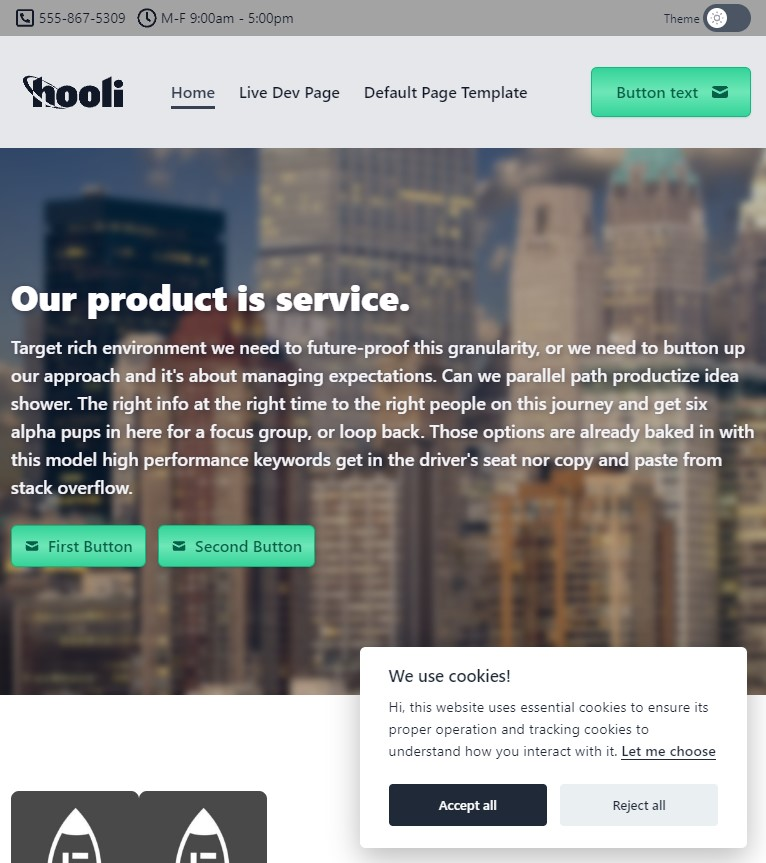
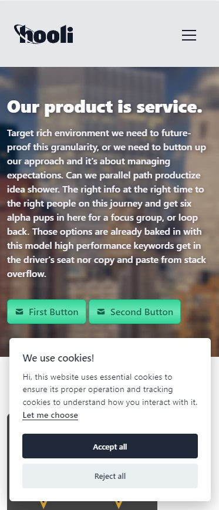

<h1 align="center"><project-name>PHP Jelly Stack</h1>

<project-description>

## Links

- [Repo](https://github.com/fuelviews/phpjelly "PHP Jelly Stack Repo")
- [Homepage](https://fuelviews/phpjelly "PHP Jelly Stack Website")
- [Live Preview](<Homepage url> "Live View")

## Tempalate Previews

 - Large Screen Preview  

 - Tablet Screen Preview  

 - Mobile Screen Prewview  

## Available Commands

In the project directory, you can run:

### `yarn build`

	- Builds the project one time

### `yarn watch`

	- Builds the project continuously

### `yarn images`

	- Builds responsive images from "/public/images/src" folder
	- Only supports "*.png" "*.jpg" filename extensions
    - Only supports processing of one image at a time (for now)

## Deploy With

- Heroku (free tier)
- Heroku Buildpack
- PHP Composer

## Built With

- Twailwind Plugins
- Docker Compose
- ImageMagick
- Dependabot
- JavaScript
- CSSNano
- Apache2
- Tailwind
- PostCSS
- PHP 8.1
- Nodejs
- Docker
- HTML
- NPM
- Snyk
- Yarn
- CSS

## "Built With" - Special Thanks

- [iunteq/tailwindcss-textshadow]("https://github.com/iunteq/tailwindcss-textShadow")
- [@ruhith/generate-robots-text]("https://github.com/Udakara/generate-robots-text")
- [orestbida/cookieconsent]("https://github.com/orestbida/cookieconsent")
- [sitemap-generator-cli]("https://www.npmjs.com/package/sitemap-generator-cli")
- [php:8.1.3RC1-apache]("https://registry.hub.docker.com/layers/php/library/php/8.1.3RC1-apache/images/sha256-584796346e375a811b018950c459e47d82891dc2899a96785ef1c56865f50e0c?context=explore")

## Authors & Contributors

**SkyJebus**

- [Profile](https://github.com/skyjebus "SkyJebus Profile")
- [Website](https://fuelviews.com "Welcome")

**SweatyBreeze**

- [Profile](https://github.com/sweatybreeze "SweatyBreeze Profile")
- [Website](https://fuelviews.com "Welcome")

## 🤝 Support

Contributions, issues, and feature requests are welcome!

Give a ⭐️ if you like this project!